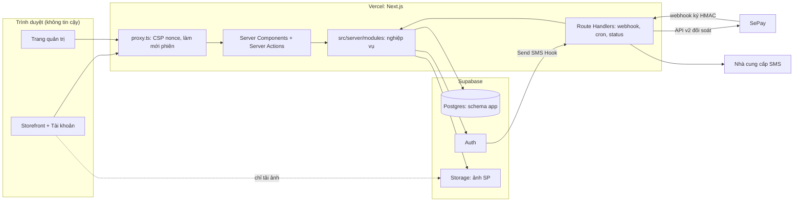
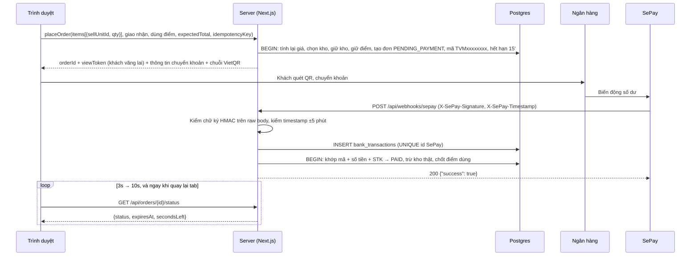

# Kiến trúc hệ thống Tường Vi Mart

## 1. Nguyên tắc

- Server là nguồn sự thật duy nhất cho giá, tồn kho, điểm, trạng thái đơn và quyền hạn. Trình duyệt chỉ hiển thị và gửi yêu cầu.
- Mặc định từ chối: thiếu cấu hình, sai chữ ký, không rõ quyền thì từ chối, không "chạy tạm bằng mock".
- Mọi thay đổi liên quan tới tiền, kho, điểm diễn ra trong một transaction Postgres, và có thể gọi lặp lại an toàn (idempotent).
- Giữ đơn giản: một ứng dụng Next.js (monolith có phân module), một database. Không microservice.
- Dữ liệu sẵn sàng đa kho ngay từ đầu, nhưng giai đoạn này chỉ vận hành 1 kho online.

## 2. Hạ tầng đã chọn

| Thành phần | Lựa chọn | Ghi chú |
|---|---|---|
| Ứng dụng web | Vercel, gói Pro | Gói Hobby không dùng cho mục đích thương mại. Tự lo TLS, CDN, vá hệ điều hành. |
| Database | Supabase Postgres, gói Pro, region Singapore (ap-southeast-1) | Gói Free bị tạm dừng khi không hoạt động và không có backup tự động. |
| Đăng nhập | Supabase Auth | Đã có sẵn: băm mật khẩu, phiên, OTP qua SMS, TOTP MFA, CAPTCHA, rate limit. |
| Ảnh sản phẩm | Supabase Storage (bucket public-read, upload bằng signed URL) | Bớt được một nhà cung cấp so với Cloudinary. |
| Thanh toán | SePay (webhook HMAC + API đối soát v2) | |
| SMS OTP | Nhà cung cấp trong nước (eSMS, SpeedSMS hoặc Zalo ZNS) qua Supabase Send SMS Hook | Cần đăng ký brandname; chủ dự án chọn nhà cung cấp. |
| CAPTCHA | Cloudflare Turnstile | Supabase Auth hỗ trợ sẵn. |
| Job định kỳ | Vercel Cron | Gọi `/api/cron/*`, bảo vệ bằng `CRON_SECRET`. |
| Theo dõi lỗi | Sentry | Tắt gửi PII mặc định. |

Lý do chọn: chủ dự án không có đội vận hành máy chủ. Dịch vụ quản lý sẵn giảm rủi ro cấu hình sai, quên vá lỗ hổng, mất backup. Đây mới là các rủi ro bảo mật lớn nhất với cửa hàng nhỏ.

Chi phí nền ước tính (tham khảo, cần kiểm tra giá hiện tại): Vercel Pro khoảng 20 USD/tháng, Supabase Pro khoảng 25 USD/tháng. Chưa gồm phí SMS, phí SePay, tên miền.

Kế hoạch thoát (nếu tư vấn pháp lý yêu cầu lưu dữ liệu tại Việt Nam):
- Database là Postgres chuẩn, truy cập qua Drizzle, không dùng tính năng riêng của Supabase ngoài Auth và Storage. Chuyển sang Postgres đặt tại Việt Nam chỉ cần đổi `DATABASE_URL` và chạy migration.
- Auth nằm sau interface `AuthPort` (`src/server/auth/`). Khi cần thay Supabase Auth thì viết adapter mới; mật khẩu băm bcrypt trong `auth.users` có thể xuất ra để chuyển.
- Storage nằm sau interface `StoragePort`.
- Ứng dụng build được dạng `output: "standalone"` để chạy bằng Docker trên VPS.

## 3. Sơ đồ thành phần



Trình duyệt không gọi trực tiếp Supabase (trừ tải ảnh public). Mọi thao tác đăng nhập đi qua Server Action, nhờ vậy rate limit, CAPTCHA và audit nằm ở server của mình.

## 4. Cấu trúc thư mục

```
.
├── CLAUDE.md
├── docs/
├── drizzle.config.ts                # cấu hình drizzle-kit (chỉ dùng ở máy dev và CI)
├── drizzle/                         # migration sinh bởi drizzle-kit (commit vào git)
├── supabase/config.toml             # cấu hình Supabase local (supabase start)
├── scripts/                         # chạy trực tiếp bằng Node; file .mts để Node hiểu là ESM
│   ├── lib/local-db-guard.mts       # chặn công cụ chạy nhầm vào database thật
│   ├── db-migrate.mts               # áp dụng migration bằng DATABASE_MIGRATION_URL
│   ├── db-set-local-password.mts    # đặt mật khẩu app_runtime ở local (chỉ APP_ENV=local)
│   ├── create-admin.ts              # tạo admin đầu tiên (chạy tay, hỏi mật khẩu qua prompt)
│   ├── seed-local.ts                # dữ liệu mẫu, từ chối chạy khi APP_ENV=production
│   └── import-admin-units.ts        # nạp danh mục 34 tỉnh/thành + phường/xã
├── src/
│   ├── proxy.ts
│   ├── app/
│   │   ├── (shop)/
│   │   │   ├── page.tsx                         # trang chủ
│   │   │   ├── danh-muc/[slug]/page.tsx
│   │   │   ├── san-pham/[slug]/page.tsx
│   │   │   ├── tim-kiem/page.tsx
│   │   │   ├── gio-hang/page.tsx
│   │   │   ├── thanh-toan/page.tsx              # checkout
│   │   │   ├── don-hang/[id]/page.tsx           # QR thanh toán, theo dõi, QR bàn giao
│   │   │   └── chinh-sach/[slug]/page.tsx       # điều khoản, quyền riêng tư, đổi trả
│   │   ├── (auth)/dang-nhap, dang-ky, quen-mat-khau
│   │   ├── tai-khoan/                           # hồ sơ, địa chỉ, đơn hàng, điểm, bảo mật
│   │   ├── admin/
│   │   │   ├── dang-nhap/page.tsx               # đăng nhập nhân viên + bước MFA
│   │   │   └── (protected)/                     # layout gọi requireStaff() phía server
│   │   │       ├── page.tsx                     # dashboard
│   │   │       ├── don-hang/  san-pham/  danh-muc/  kho/  khach-hang/
│   │   │       ├── nhan-vien/  thanh-toan/  hoan-tien/  bao-cao/
│   │   │       └── cai-dat/  nhat-ky/
│   │   └── api/
│   │       ├── webhooks/sepay/route.ts
│   │       ├── auth-hooks/send-sms/route.ts
│   │       ├── orders/[id]/status/route.ts
│   │       └── cron/[job]/route.ts              # expire-orders, reconcile-payments, retry-bank-tx, cleanup
│   ├── components/
│   │   ├── ui/                                  # Button, Input, Modal, Badge... (thuần hiển thị)
│   │   ├── shop/                                # ProductCard, CartDrawer, Header... (port từ code cũ)
│   │   └── admin/
│   ├── stores/                                  # Zustand, chỉ trạng thái UI
│   │   ├── cart.ts                              # [{sellUnitId, qty}] + persist localStorage
│   │   └── ui.ts
│   ├── lib/                                     # hàm thuần dùng chung client/server
│   │   ├── format.ts  slugify.ts  geo.ts  phone.ts
│   └── server/                                  # mọi file: import "server-only"
│       ├── env.ts                               # Zod parse biến môi trường, fail-fast
│       ├── db/ client.ts  schema/*.ts  tx.ts
│       ├── auth/ port.ts  supabase.adapter.ts  session.ts  guards.ts
│       ├── lib/ errors.ts  logger.ts  rate-limit.ts  tokens.ts  money.ts  clock.ts  vietqr.ts  safe-equal.ts
│       ├── security/ headers.ts                 # hàm thuần dựng CSP + header bảo mật; proxy.ts gọi
│       ├── adapters/                            # "Switchboard"
│       │   ├── payment/ index.ts  sepay.ts  fake.ts
│       │   ├── sms/ index.ts  console.ts  esms.ts (hoặc nhà cung cấp được chọn)
│       │   ├── storage/ index.ts  supabase.ts  memory.ts
│       │   ├── captcha/ index.ts  turnstile.ts  always-pass.ts
│       │   └── notifier/ index.ts  noop.ts  telegram.ts (tùy chọn)
│       └── modules/
│           ├── catalog/  pricing/  inventory/  fulfillment/
│           ├── checkout/  orders/  payments/  handover/  refunds/
│           ├── loyalty/  customers/  staff/  settings/
│           ├── reports/  analytics/  audit/  notifications/
│           └── (mỗi module: service.ts, repo.ts, schemas.ts, *.test.ts)
└── tests/
    ├── integration/   # chạy với Postgres local (supabase start)
    ├── e2e/           # Playwright
    └── factories/
```

## 5. Phân lớp và luồng request

```
UI (Server Component / Client Component)
  → Server Action hoặc Route Handler
      1. requireX()           xác thực + phân quyền (server/auth/guards.ts)
      2. rateLimit(key)       nếu là thao tác nhạy cảm
      3. schema.parse(input)  Zod
      4. service.doThing()
  → service (nghiệp vụ, gọi hàm thuần + repo, mở transaction)
  → repo (Drizzle)
```

Quy tắc:
- Server Action là endpoint công khai: ai cũng gọi được nếu biết ID. Mỗi action phải tự gọi guard, không dựa vào việc trang đã được bảo vệ.
- Guard: `requireCustomer()`, `requireStaff()`, `requireAdmin({ mfa: true })`, `requireOrderAccess(orderId, { viewToken? })`.
- Quyền đọc từ database mỗi request (bảng `staff_members`, `customers`), không tin claim do client gửi. Vô hiệu hóa nhân viên có hiệu lực ngay.
- Thao tác nhạy cảm của admin (hoàn tiền, xử lý giao dịch ngoại lệ, tạo/đổi quyền nhân viên, điều chỉnh điểm lớn, sửa cài đặt tiền) cần MFA step-up trong 10 phút gần nhất.

## 6. Đăng nhập và phiên

Khách hàng:
- Đăng ký: nhập họ tên, SĐT, mật khẩu (+ Turnstile) → Supabase `signUp({ phone, password })` gửi OTP → nhập OTP (`verifyOtp`, type `sms`) → tạo bản ghi `customers`.
- Đăng nhập: SĐT + mật khẩu (`signInWithPassword`). Sau 5 lần sai trong 15 phút, bắt buộc Turnstile.
- Quên mật khẩu: OTP qua SMS (`signInWithOtp` với `shouldCreateUser: false`) → xác thực → đặt mật khẩu mới → thu hồi các phiên khác.
- Đổi mật khẩu khi đang đăng nhập: yêu cầu mật khẩu hiện tại (hoặc reauthenticate bằng OTP).
- SĐT lưu dạng E.164 (`+84...`), chỉ chấp nhận đầu số di động Việt Nam hợp lệ.

Nhân viên và admin:
- Đăng nhập tại `/admin/dang-nhap` bằng username + mật khẩu. Username ánh xạ tới email nội bộ `username@staff.<tên-miền-của-shop>` trong Supabase Auth (không gửi email thật). Cách này tách danh tính nhân viên khỏi SĐT khách hàng.
- Admin tạo tài khoản nhân viên qua Admin API (service key, chỉ server), với mật khẩu tạm và cờ `must_change_password`.
- Admin bắt buộc TOTP MFA: chưa đăng ký MFA thì chỉ vào được trang đăng ký MFA; phiên admin phải ở mức AAL2.
- Nhân viên nghỉ việc: admin vô hiệu hóa → `staff_members.is_active = false` + thu hồi mọi phiên qua Admin API.
- Tài khoản nhân viên không dùng để mua hàng.

Cookie phiên: do `@supabase/ssr` quản lý, cấu hình `httpOnly`, `secure`, `sameSite=lax`, `path=/`. Proxy chỉ làm mới phiên, không quyết định quyền.

Thiết lập Supabase Auth cần bật: phone provider + Send SMS Hook, email provider (chỉ phục vụ đăng nhập nhân viên, tắt gửi email xác nhận vì tài khoản do admin tạo), độ dài mật khẩu tối thiểu 8, chặn mật khẩu đã bị lộ (nếu gói hỗ trợ), CAPTCHA Turnstile, MFA TOTP, rate limit OTP.

Lưu ý: API Auth của Supabase là công khai, nên về lý thuyết ai đó vẫn có thể tạo tài khoản Auth trực tiếp. Vì vậy guard luôn yêu cầu có bản ghi tương ứng trong `customers` hoặc `staff_members` (đang hoạt động); tài khoản Auth "mồ côi" không làm được gì. CAPTCHA giúp hạn chế tạo tài khoản rác.

## 7. Luồng đặt hàng và thanh toán

Chi tiết quy tắc nằm ở `BUSINESS_RULES.md` mục 4 và 5.



Lớp dự phòng:
- `cron/reconcile-payments` (5 phút/lần): gọi SePay API v2 `GET /v2/transactions` với `since_id`, đưa từng giao dịch qua cùng hàm xử lý với webhook.
- `cron/retry-bank-tx` (2 phút/lần): xử lý lại các dòng `bank_transactions` còn trạng thái `RECEIVED`.
- Nếu hai nguồn cùng ghi một giao dịch mà khóa chống trùng khác nhau, đơn vẫn không bị ghi PAID hai lần (UPDATE có điều kiện); giao dịch thứ hai thành ngoại lệ `DUPLICATE_OR_EXTRA` để admin kiểm tra.

## 8. Job định kỳ (Vercel Cron)

| Job | Tần suất | Việc |
|---|---|---|
| `expire-orders` | 1 phút | Đơn `PENDING_PAYMENT` quá `expires_at` + 5 phút ân hạn → `EXPIRED`, trả kho giữ, trả điểm giữ |
| `reconcile-payments` | 5 phút | Đối soát với SePay API |
| `retry-bank-tx` | 2 phút | Xử lý lại giao dịch kẹt |
| `cleanup` | 1 ngày | Xóa `rate_limits` cũ, xóa sự kiện analytics quá hạn lưu, dọn view token hết hạn |
| `daily-digest` | 1 ngày | Gửi chủ shop tóm tắt: doanh thu, ngoại lệ thanh toán, thao tác nhạy cảm của admin |

Mỗi route cron kiểm tra header `Authorization: Bearer ${CRON_SECRET}` bằng `safeEqual`, và phải chạy lặp an toàn.

## 9. Switchboard (adapter) theo kiểu đóng cửa khi lỗi

Mỗi dịch vụ ngoài có một interface (port) và nhiều adapter. `adapters/<port>/index.ts` chọn adapter dựa trên biến môi trường đã được `env.ts` kiểm tra.

```ts
// ví dụ: src/server/adapters/sms/index.ts
import "server-only";
import { env } from "@/server/env";
export const sms: SmsPort =
  env.SMS_PROVIDER === "console" ? consoleSms : createEsmsAdapter(env.ESMS_API_KEY!, env.ESMS_SECRET!);
```

Quy tắc:
- `env.ts` từ chối `SMS_PROVIDER=console`, `PAYMENT_PROVIDER=fake`, `CAPTCHA_PROVIDER=always-pass`, `STORAGE_PROVIDER=memory` khi `APP_ENV=production` hoặc `staging`.
- Adapter chưa làm xong phải `throw new NotImplementedError()`, không bao giờ trả `success: true` giả.
- Không có "tự động chuyển về mock khi thiếu key". Thiếu key ở production thì ứng dụng không khởi động.

Các port: `PaymentProviderPort` (verifyWebhook, parseWebhook, listTransactions), `SmsPort` (sendOtp, sendMessage), `StoragePort` (createSignedUpload, getPublicUrl, delete), `CaptchaPort` (verify), `NotifierPort` (notifyOwner), `AuthPort` (bọc Supabase Auth).

## 10. Môi trường và biến môi trường

Môi trường: `local` (máy dev + `supabase start`; dùng được cả SePay Test mode qua tunnel), `test` (CI), `staging` (tùy chọn, trước mở bán: Supabase Free + SePay Test mode), `production`. Giai đoạn phát triển không cần tài khoản trả phí nào.

| Biến | Phạm vi | Ghi chú |
|---|---|---|
| `APP_ENV` | server | local, test, staging, production |
| `APP_URL` | server | URL gốc, dùng kiểm Origin và tạo link |
| `DATABASE_URL` | server | role `app_runtime`, qua pooler transaction mode (postgres-js `prepare: false`) |
| `DATABASE_MIGRATION_URL` | CI/local | role có quyền DDL, KHÔNG đặt trên Vercel runtime |
| `SUPABASE_URL`, `SUPABASE_PUBLISHABLE_KEY` | server | không cần `NEXT_PUBLIC_` vì trình duyệt không gọi Supabase |
| `SUPABASE_SECRET_KEY` | server | service key, chỉ dùng trong `auth/supabase.adapter.ts` và `adapters/storage` |
| `SEPAY_WEBHOOK_SECRET` | server | HMAC secret |
| `SEPAY_API_TOKEN` | server | cho đối soát |
| `PAYEE_BANK_BIN`, `PAYEE_BANK_NAME`, `PAYEE_ACCOUNT_NO`, `PAYEE_ACCOUNT_NAME` | server | tài khoản nhận tiền; chỉ đổi bằng cách đổi env + redeploy |
| `PAYMENT_PROVIDER`, `SMS_PROVIDER`, `CAPTCHA_PROVIDER`, `STORAGE_PROVIDER` | server | chọn adapter |
| `SMS_HOOK_SECRET` | server | xác thực request từ Supabase Send SMS Hook |
| `TURNSTILE_SECRET_KEY` | server | |
| `NEXT_PUBLIC_TURNSTILE_SITE_KEY` | public | khóa công khai, được phép |
| `HANDOVER_SECRET` | server | khóa HMAC để tính token/PIN bàn giao (BUSINESS_RULES mục 6) |
| `VIEW_TOKEN_PEPPER` | server | khóa HMAC để băm view token của khách vãng lai |
| `CRON_SECRET` | server | |
| `SENTRY_DSN` | server + public | DSN không phải secret |
| `OWNER_ALERT_*` | server | kênh cảnh báo cho chủ shop (tùy chọn) |

`env.ts` phải có test: thiếu biến bắt buộc hoặc cấu hình mock ở production thì `parse` báo lỗi.

## 11. Hiển thị, SEO, hiệu năng

- Trang public (trang chủ, danh mục, sản phẩm) là Server Component, có `generateMetadata`, `sitemap.ts`, `robots.ts`, JSON-LD `Product`.
- CSP dùng nonce nên MỌI trang render động: root layout gọi `await connection()` để Next.js gắn nonce lúc render theo request (trang tĩnh dựng lúc build không có nonce, script của chính Next.js sẽ bị chặn). Hệ quả: HTML có `Cache-Control: private, no-cache, no-store`, CDN không cache HTML, mỗi lượt xem tốn một lần render; file `/_next/static` vẫn cache vĩnh viễn. Bù bằng cache dữ liệu (`unstable_cache` hoặc tương đương, có tag để invalidate khi admin sửa sản phẩm) để giảm tải database.
- Next.js 16 đổi tên convention `middleware` thành `proxy` (bản cũ deprecated). Dự án dùng `src/proxy.ts`, export hàm `proxy`, chạy trên Node.js runtime (xem N26).
- Ảnh qua `next/image`, `remotePatterns` chỉ cho phép domain Supabase Storage của dự án.
- Tìm kiếm: Postgres full-text + `unaccent` + `pg_trgm` để gõ không dấu vẫn ra ("banh mi" → "Bánh mì").
- Viewport cho phép phóng to (không đặt `maximumScale`, `userScalable`).
- Giỏ hàng lưu ở client (chỉ `sellUnitId` + `qty`). Giá hiển thị trong giỏ lấy từ `quoteCart()` phía server.

## 12. Quan sát và vận hành

- Logger JSON có `requestId`, tự che SĐT, bỏ các trường nhạy cảm (`password`, `token`, `otp`, `secret`, `authorization`).
- Sentry: `sendDefaultPii: false`, lọc header `cookie`/`authorization`.
- Cảnh báo cho chủ shop khi: có ngoại lệ thanh toán, chữ ký webhook sai quá 5 lần trong 10 phút, job cron lỗi, đơn PAID quá 30 phút chưa có người nhận đóng gói (trong giờ mở cửa).
- Backup: backup hằng ngày của Supabase Pro, cộng bản `pg_dump` hằng tuần (GitHub Action) mã hóa, lưu ở nơi khác. Mỗi tháng thử khôi phục vào project staging.

## 13. Mở rộng đa kho (sau này)

- Dữ liệu đã có `warehouses`, `stock_levels(warehouse_id, product_id)`, `orders.warehouse_id`.
- `fulfillment/strategy.ts` định nghĩa `chooseWarehouse(items, deliveryPoint): WarehouseId | NoWarehouse`.
  - Hiện tại: `SingleOnlineWarehouseStrategy` (luôn kho online mặc định, kiểm bán kính).
  - Sau này: `NearestWarehouseWithFullStockStrategy`: lọc các kho còn ĐỦ toàn bộ hàng của đơn, trong bán kính giao của kho đó, chọn kho gần nhất.
- Không bao giờ tách một đơn ra nhiều kho (quyết định D4).
- Khi mở thêm kho: thêm UI quản lý kho, phân quyền nhân viên theo kho (`staff_members.warehouse_id`), báo cáo theo kho.
